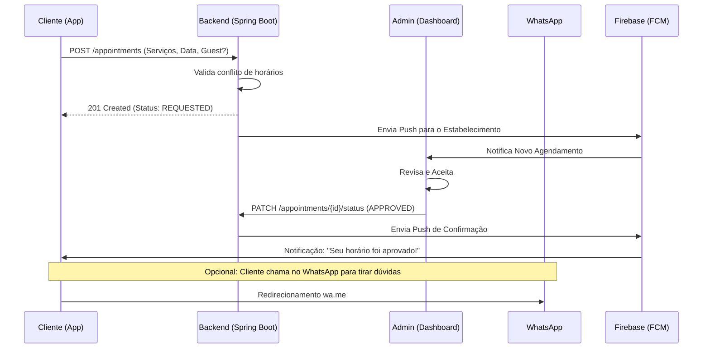
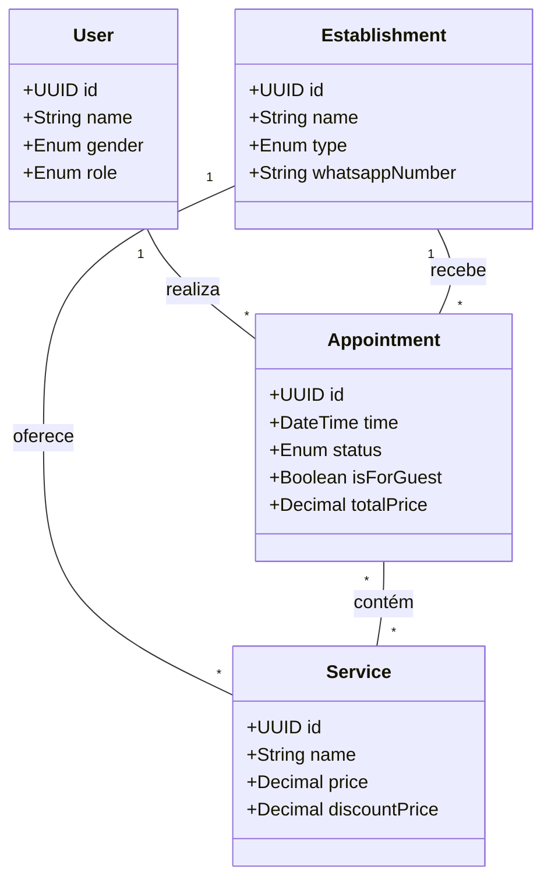
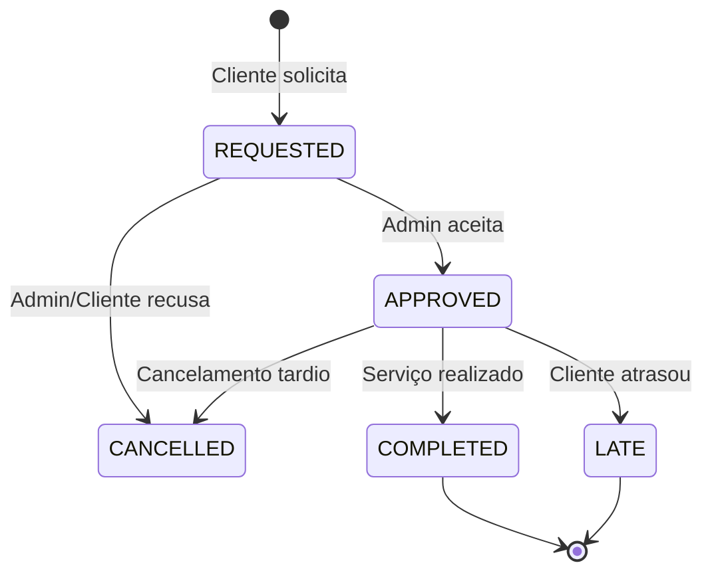
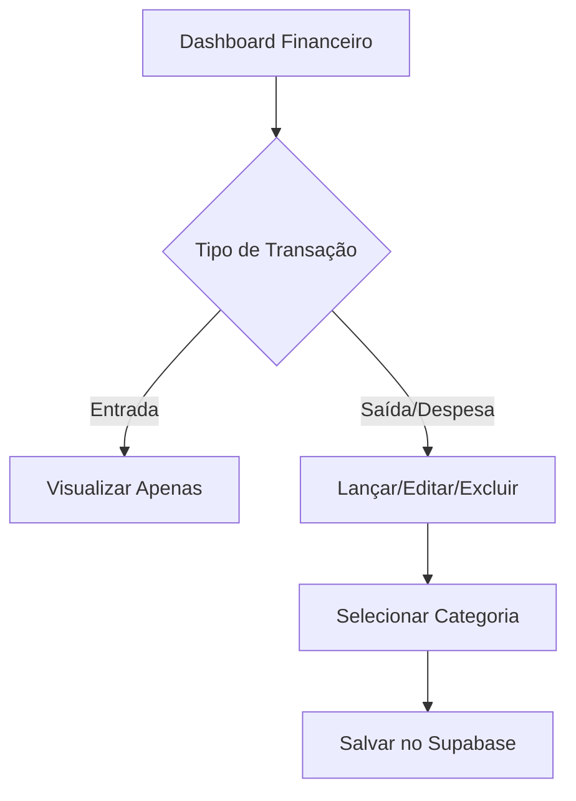

# Especificações de Fluxo e Diagramas: Agendei. 📊

Este documento contém a representação visual e técnica da lógica do sistema, utilizando Mermaid para diagramação.

---

## 1. Fluxo de Atividade (Onboarding & Home)
```mermaid
activityDiagram
    start
    :Login via Google;
    if (Primeiro Acesso?) then (Sim)
        :Solicitar Celular;
        :Solicitar Gênero (Masc/Fem);
    else (Não)
    endif
    if (Gênero == Masculino) then
        :Redirecionar Sessão Barbearia;
        :Exibir Especialidades (Barba, Black, etc.);
    else
        :Redirecionar Sessão Salão;
        :Exibir Especialidades (Corte, Coloração, etc.);
    endif
    stop
```

---

## 2. Diagrama de Sequência (Agendamento & Aprovação)


---

## 3. Diagrama de Classes UML (Simplificado)


---

## 4. Diagrama de Estados do Agendamento


---

## 5. Fluxo de Retenção (Firebase)
*   **Trigger**: 25-30 dias sem novo agendamento.
*   **Ação**: Backend detecta via Job agendado.
*   **Canal**: Push Notification (FCM).
*   **Conteúdo**: "Sentimos sua falta! Que tal agendar seu próximo corte?".

---

## 6. Fluxo Administrativo (Dashboard)

### 6.1 Gestão de Fluxo de Caixa


### 6.2 Controle de Disponibilidade (Pausa)
- **Ação**: Admin seleciona dias no calendário.
- **Visual**: Ícone de café animado indica status "Pausado" na Home.
- **Impacto**: Impede novos agendamentos de clientes para as datas selecionadas.
